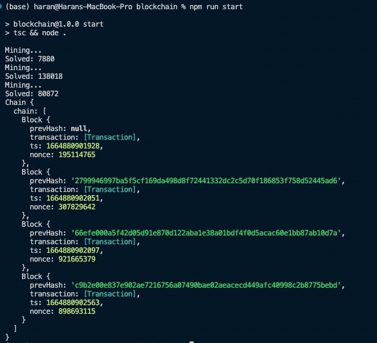

# drachma71

It is a basic blockchain implementation coded in typescript. The crypto.js library was used for the cryptography requirements of the blockchain

## Basic Overview

Each user has a wallet which contains their public key (through which they recive money) and a private key(by which they can spend money). 

Whenever a user wants to send money to another user, a new transaction object is created which consists of the amount to be sent, and the public keys of both the users.

This transaction is then signed using the private key of the sender.

After this a new block object is created which contains the timestamp of the creation of the block, the hash of the most recent block added to the blockchain and the transaction for which it has been made. 

Before adding the block to the blockchain, we do two things. We first verify the signature of the sender by using their public key. Secondly, we have to implement the proof of work sysytem in order to validate each block. 

This proof of work system was brought about in order to tackle the double spending problem, and is done by using the computing resources by all other nodes on the network to perform some intensive computation before adding a block on to the blockchain.

The computation is as follows. Each block has a nonce value associated with it, in this case it is randomly generated number from 0 to 10^10 -1. Then before adding the block to the blockchain, we try to find a value that when added to nonce produces a hash (any algorithmn can be used, here I have used the MD5 hashing algorithmn) that satisfies a certain condition, in this case the condition is that the first 4 numbers of the hash must be zeroes.

The finding of this value is where the heavy computation is required. And when the solution is found, the block is added to the blockchain.

## References 

Original White Paper: https://bitcoin.org/bitcoin.pdf

This paper was used almost exclusively as a reference for this project. 

## Example Usage output

## Skill Acquired

-> Learnt how a peer to peer based elctronic cash system would be implemented and how it would enable validations of transactions directly between users without a third party intermediary.

-> Learnt how develop and run a project using typescript and its compiler.

-> Learnt how to use the crypt.js module for hashing,creating publickey-privatekey pairs and creating signatures.
